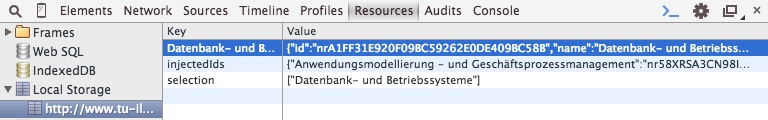

# 2. Review

## Technischer Hintergrund

### Initialisierung
Der Einstieg in die Programmlogik befindet sich in der Datei namens `init.js`. Diese initialisiert das Programm, indem es benötigte Variablen entweder aus dem Speicher liest, oder diese leer erzeugt, wie zum Beispiel ein Array für den "Warenkorb". Im Anschluss erzeugt es die Seitenleiste für den Warenkorb, der auf allen Seiten des VLV vorhanden sein wird. Es folgen dann einige Überprüfungen, die je nachdem auf welcher Unterseite man sich befindet, bestimmte Elemente erzeugen und Funktionen aufrufen. Im Folgenden bezieht sich der gesamte Ablauf auf die Textansicht eines bestimmten Studienganges.

Da die Überprüfung, ob es sich um die Textversion handelt, positiv ausfällt, wird nun die Logik aufgerufen, welche alle Veranstaltungen auf der Seite sucht und diese in einem Array temporär speichert. An diesem Punkt wird außerdem überprüft, ob alle Elemente eine ID enthalten, welche zum weiteren Programmablauf benötigt wird. Ist diese nicht vorhanden, so wird eine zufällige erzeugt, dem Element zugeordnet und die ID persistent abgespeichert, damit in Zukunft einem Objekt, welches schon eine neue ID erhielt, wieder dieselbe zugewiesen werden kann.
Anhand des Arrays der Veranstaltungen werden auf dieser Seite nun Buttons eingefügt, die es erlauben, eine Veranstaltung zu dem Warenkorb hinzuzufügen. Des weiteren werden Ränder eingefügt, um Veranstaltungen optisch von anderen abzugrenzen. Des weiteren wird in diesem Punkt eine Logik aufgerufen, die den Nutzer darüber informiert, ob in den letzten 2 Wochen (Zeitraum wird in zukünftigen Versionen konfigurierbar sein) Änderungen der Daten stattgefunden haben. Dies erfolgt über eine optische Hervorhebung der Aktualisierungsdaten und über eine Benachrichtigung in der rechten oberen Ecke der Seite. Am Ende der Initialisierung wird aus dem Speicher ein eventuell vorhandener Warenkorb aus einer vorherigen Sitzung ausgelesen und diese Auswahl erneut hervorgenommen.
Nun ist die Initialisierung abgeschlossen und der weitere Programmablauf wird durch die Interaktionen des Nutzers bestimmt.

### Auswahl einer Veranstaltung
Wird eine Veranstaltung zum Warenkorb hinzugefügt, so wird eine Funktion namens `saveToCart()` aufgerufen. Diese Funktion erzeugt ein leeres JSON Objekt nach folgendem Aufbau:

~~~js
{
	id: "",
	name: "",
	link: [],
	location: "",
	begin: "",
	end: "",
	comment: ""
}
~~~

Dieses noch leere Objekt wird nun nach und nach mit Informationen gefüllt:
- `id`: Die eindeutige ID des Container-Objekts (ein div Objekt) dieser Veranstaltung
- `name`: Der Name der Veranstaltung
- `link`: Der DOM-Pfad zu dem Container-Objekt dieser Veranstaltung (um später wieder auf das ursprüngliche Objekt schließen zu können)
- `location`: Der Ort, an dem die Veranstaltung stattfinden wird
- `begin`: Der Startzeitpunkt, an dem die Veranstaltung beginnt
- `end`: Der Endzeitpunkt, an dem die Veranstaltung endet
- `comment`: Ein Kommentar zu der Veranstaltung, in dem wir die/den Lesende(n) einfügen

Die werte `name`, `location`, `begin`, `end` und `comment` sind durch den Nutzer später durch einen modalen Dialog änderbar.

### Datenextraktion
Der Aufbau einer Veranstaltung im VLV sieht aus wie folgt:

~~~html

	
Einführung in ERP-Systeme <a href="http://wcms3.rz.tu-ilmenau.de/%7Egoettlich/elvvi/sommer/list/fachseite.php?fid=562E99540764C6FAB44F232FB3CA3A60" target="_blank" title="Beschreibung von Einführung in ERP-Systeme (neues Fenster)">Beschreibung</a>

	
Lesende(r): Prof. Nissen, Fak. WM

	<table border="1" cellspacing="0" summary="Liste der Veranstaltungen" width="99%">
		<thead>
			<tr>
				<th class="stupla_fs09" scope="col">&nbsp;</th>
				<th class="stupla_fs09" scope="col" axis="Tag">Wochentag</th>
				<th class="stupla_fs09" scope="col" axis="Zeitraum/Datum">Zeitraum/ Datum</th>
				<th class="stupla_fs09" scope="col" axis="Uhrzeit">Uhrzeit</th>
				<th class="stupla_fs09" scope="col" axis="Raum">Raum</th>
				<th class="stupla_fs09" scope="col" axis="Zielgruppe">Zielgruppe</th>
				<th class="stupla_fs09" scope="col" axis="Änderungsdatum">Änderungsdatum</th>
			</tr>
		</thead>
		<tbody>
			<tr valign="top">
				<th class="stupla_fs09" axis="Klausur:" scope="rowgroup" width="10%">Klausur:</th>
				<td width="10%">Mittwoch</td>
				<td width="10%">05.08.2015</td>
				<td width="10%">17.00 - 18.00</td>
				<td width="20%">H-Hs</td>
				<td width="20%">WI 4.FS 1, WI 4.FS 2</td>
				<td width="20%">Geändert am: 28.05.15</td>
			</tr>
		</tbody>
	</table>

~~~

Haben wir den Elternknoten (`

`), so können wir die Kindknoten leicht auslesen. Dies erfolgt beispielsweise durch einen Aufruf wie: 

~~~js
object.childNodes[3].innerText.slice(12)
~~~

Das `object` wäre hierbei unser oberster Elternknoten. Von diesem aus wird das 3. Kindelement aufgerufen, davon dann der Wert `innerText` (da man sonst auch die HTML-Tags bekommt, welche wir nicht wollen). Abschließend wird durch `slice(12)` noch das vorhergehende `Lesende(r): ` abgeschnitten, damit wir als Ergebnis nur einen String mit dem Inhalt `Prof. Nissen, Fak. WM` erhalten.
Analog dazu erfolgt das Auslesen der restlichen Informationen, wobei gegebenenfalls Informationen, wie die Uhrzeit und Datum vorher noch geparsed werden müssen.

### Speicherung der Daten im Local Storage des Browsers
Damit wir diese Informationen nach einem Schließen des Browserfensters nicht verlieren, speichern wir diese dann im local Storage ab.
Jeder moderne Browser unterstützt diese Art der Speicherung. Die Objekte bleiben so lange erhalten, bis man sie explizit löscht. Implementiert ist dieser Storage durch einen simplen Key-Value-Storage, der es erlaubt zu einem beliebigen Key einen beliebigen Value zu speichern, wobei der Value aber nur in Form eines Strings abgespeichert werden kann.

Um pro Key mehr Informationen abspeichern zu können, bieten sich die Funktionen `JSON.stringify()` und `JSON.parse()` an. Erstere wandelt ein JSON Objekt in einen String um und zweitere in umgekehrte Richtung. 

#### Beispiel
~~~js
var writeData = {
    id: "Test123",
    name: "Datensatz1",
}

localStorage.setItem(writeData.id, JSON.stringify(writeData));

var readData = JSON.parse(localStorage['Datensatz1'])

console.log(readData);
~~~
Dieser kleine Ablauf erzeugt ein JSON Objekt, welches eine ID und einen Namen besitzt. Dieses wird dann in den Local Storage geschrieben, indem es in einen String umgewandelt wird und unter dem Key 'Test123' abgespeichert wird. Durch `JSON.parse()` wird der gelesene String wieder in ein JSON Objekt umgewandelt und kann dann in der Konsole ausgegeben und als Objekt betrachtet werden.